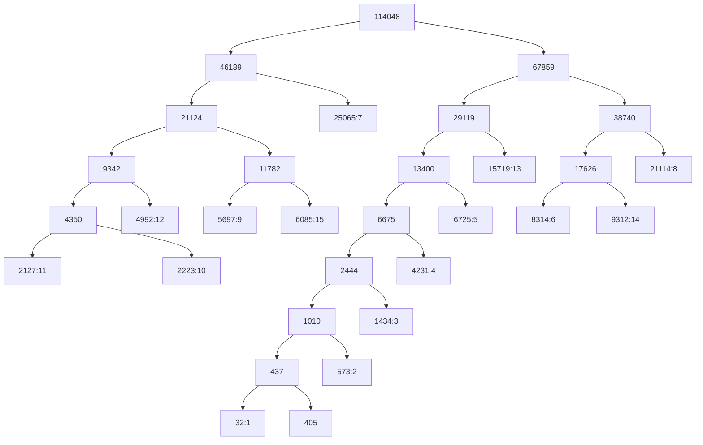

# Assignment 1 code outputs

## Task 1

Convert an image from RGB to YCbCr 4:2:0 and recover it.

Below are the metrics to compare
the copied and transformed images in the RGB color space:

```python
[['<Metrics>', '<Score>', '<Goal>'],
 ['MAE', '0.48102', '0.00000'],
 ['MSE', '0.73883', '0.00000'],
 ['NRMSE', '0.00483', '0.00000'],
 ['PSNR', '49.44534', 'inf'],
 ['SSIM', '0.99853', '1.00000']]
```

## Task 3

Quantize and encode YCbCr 4:2:0 images and recover them.

Below is the Huffman codebook from quantization level to code:

```python
{0: '10000001',
 1: '10000000',
 2: '1000001',
 3: '100001',
 4: '10001',
 5: '1001',
 6: '1100',
 7: '01',
 8: '111',
 9: '0010',
 10: '00001',
 11: '00000',
 12: '0001',
 13: '101',
 14: '1101',
 15: '0011'}
```

    Below is the Huffman coding tree in Mermaid diagram syntax:


