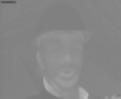
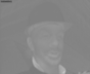

# Assignment 1 Code Outputs

## Reproduction

1. Install the requirements
```shell
python3 -m pip install -Ur requirements.txt
```

2. Run all the tasks
```shell
python3 run_tasks.py
```

## Task 1

Convert an image from RGB to YCbCr `4:2:0` and recover it.

*Assume that the copied image is equivalent to the original image.*

### Visual Comparison

Display images.

I added transformed images from YCbCr to RGB using `utils/YUVDisplay.exe`.

There are the images in the RGB color space below.

| Copied Image | Transformed Image (Mine) | Transformed Image (YUVDisplay.exe) |
| ------------ | ------------------------ | ---------------------------------- |
|  |  |  |

There are the images in the YCbCr color space re-mapped to the grayscale colorspace below.

|             | Before sub-sampling | After sub-sampling | After up-sampling |
| ----------- | ------------------- | ------------------ | ----------------- |
| On Y plane  |   |  |   |
| On Cb plane |  |   |  |
| On Cr plane |  |   |  |

### Statistical Comparison

Compare between the copied and transformed images in the RGB color space.

There are the metric results computed
between the copied and transformed images below.

```python
[['<Metrics>', '<Score>', '<Goal>'],
 ['MAE', '0.48102', '0.00000'],
 ['MSE', '0.73883', '0.00000'],
 ['NRMSE', '0.00483', '0.00000'],
 ['PSNR', '49.44534', 'inf'],
 ['SSIM', '0.99853', '1.00000']]
```

### Details

The process workflow is as follows.


## Task 2

Convert the multiple images from RGB to YCbCr `4:2:0` color space
and pack them into a file in planar format.

### Visual Comparison

Display images.

I added the up-sampled images and re-exported them using `utils/YUVDisplay.exe`
for comparison purposes since they have the same size as the original ones.

The images with sequence number `0` are displayed below.

There are the images in the RGB color space below.

| Original Image | Transformed Image (YUVDisplay.exe) |
| -------------- | ---------------------------------- |
|  |  |

There are images in the YCbCr color space re-mapped to the grayscale color space below.

|             | Without sub-sampling | With sub-sampling | With up-sampling |
| ----------- | -------------------- | ----------------- | ---------------- |
| On Y plane  |   |  |   |
| On Cb plane |  |   |  |
| On Cr plane |  |   |  |
The images with sequence number `1` are displayed below.

There are the images in the RGB color space below.

| Original Image | Transformed Image (YUVDisplay.exe) |
| -------------- | ---------------------------------- |
|  |  |

There are images in the YCbCr color space re-mapped to the grayscale color space below.

|             | Without sub-sampling | With sub-sampling | With up-sampling |
| ----------- | -------------------- | ----------------- | ---------------- |
| On Y plane  |   |  |   |
| On Cb plane |  |   |  |
| On Cr plane |  |   |  |
The images with sequence number `2` are displayed below.

There are the images in the RGB color space below.

| Original Image | Transformed Image (YUVDisplay.exe) |
| -------------- | ---------------------------------- |
|  |  |

There are images in the YCbCr color space re-mapped to the grayscale color space below.

|             | Without sub-sampling | With sub-sampling | With up-sampling |
| ----------- | -------------------- | ----------------- | ---------------- |
| On Y plane  |   |  |   |
| On Cb plane |  |   |  |
| On Cr plane |  |   |  |

### Statistical Comparison

Compare between the images without sub-sampling and with sub-sampling
in the YCbCr color space.

There are the metric results computed
between the copied and transformed images below.

The image pair with sequence number `0`:

On the Y plane:

```python
[['<Metrics>', '<Score>', '<Goal>'],
 ['MAE', '0.00000', '0.00000'],
 ['MSE', '0.00000', '0.00000'],
 ['NRMSE', '0.00000', '0.00000'],
 ['PSNR', 'inf', 'inf'],
 ['SSIM', '1.00000', '1.00000']]
```

On the Cb plane:

```python
[['<Metrics>', '<Score>', '<Goal>'],
 ['MAE', '0.01610', '0.00000'],
 ['MSE', '0.04553', '0.00000'],
 ['NRMSE', '0.00179', '0.00000'],
 ['PSNR', '61.54750', 'inf'],
 ['SSIM', '0.99981', '1.00000']]
```

On the Cr plane:

```python
[['<Metrics>', '<Score>', '<Goal>'],
 ['MAE', '0.02233', '0.00000'],
 ['MSE', '0.22230', '0.00000'],
 ['NRMSE', '0.00350', '0.00000'],
 ['PSNR', '54.66139', 'inf'],
 ['SSIM', '0.99976', '1.00000']]
```
The image pair with sequence number `1`:

On the Y plane:

```python
[['<Metrics>', '<Score>', '<Goal>'],
 ['MAE', '0.00000', '0.00000'],
 ['MSE', '0.00000', '0.00000'],
 ['NRMSE', '0.00000', '0.00000'],
 ['PSNR', 'inf', 'inf'],
 ['SSIM', '1.00000', '1.00000']]
```

On the Cb plane:

```python
[['<Metrics>', '<Score>', '<Goal>'],
 ['MAE', '0.01172', '0.00000'],
 ['MSE', '0.04076', '0.00000'],
 ['NRMSE', '0.00169', '0.00000'],
 ['PSNR', '62.02855', 'inf'],
 ['SSIM', '0.99988', '1.00000']]
```

On the Cr plane:

```python
[['<Metrics>', '<Score>', '<Goal>'],
 ['MAE', '0.02225', '0.00000'],
 ['MSE', '0.21607', '0.00000'],
 ['NRMSE', '0.00345', '0.00000'],
 ['PSNR', '54.78492', 'inf'],
 ['SSIM', '0.99980', '1.00000']]
```
The image pair with sequence number `2`:

On the Y plane:

```python
[['<Metrics>', '<Score>', '<Goal>'],
 ['MAE', '0.00000', '0.00000'],
 ['MSE', '0.00000', '0.00000'],
 ['NRMSE', '0.00000', '0.00000'],
 ['PSNR', 'inf', 'inf'],
 ['SSIM', '1.00000', '1.00000']]
```

On the Cb plane:

```python
[['<Metrics>', '<Score>', '<Goal>'],
 ['MAE', '0.01417', '0.00000'],
 ['MSE', '0.04257', '0.00000'],
 ['NRMSE', '0.00173', '0.00000'],
 ['PSNR', '61.83934', 'inf'],
 ['SSIM', '0.99984', '1.00000']]
```

On the Cr plane:

```python
[['<Metrics>', '<Score>', '<Goal>'],
 ['MAE', '0.02095', '0.00000'],
 ['MSE', '0.21784', '0.00000'],
 ['NRMSE', '0.00346', '0.00000'],
 ['PSNR', '54.74938', 'inf'],
 ['SSIM', '0.99982', '1.00000']]
```

### Details

The process workflow is as follows.


## Task 3

Quantize in 16 levels and encode YCbCr `4:2:0` images and recover them.

Uses Huffman coding scheme.

### Visual Comparison

Display structures and images.

There are 16 symbols in Huffman code table as the number of quantization levels.

There are the code table and tree diagram of the Huffman tree used below.

```python
{0: '10000001',
 1: '10000000',
 2: '1000001',
 3: '100001',
 4: '10001',
 5: '1001',
 6: '1100',
 7: '01',
 8: '111',
 9: '0010',
 10: '00001',
 11: '00000',
 12: '0001',
 13: '101',
 14: '1101',
 15: '0011'}
```


I added assertion checks to ensure that
the decoded images are equal to the quantized images.
(See the module `src.tasks.quantize_and_encode_multi_frame_in_ycbcr420_and_back`)

I added the re-exported images using `utils/YUVDisplay.exe`
for comparison purposes since they have the same size as the original ones.

The images with sequence number `0` are displayed below.

There are the images in the RGB color space below.

| Original Image | Transformed Image (YUVDisplay.exe) |
| -------------- | ---------------------------------- |
|  |  |

There are images in the YCbCr color space re-mapped to the grayscale color space below.

|             | Before quantized | After de-quantized |
| ----------- | ---------------- | ------------------ |
| On Y plane  |  |  |
| On Cb plane |   |   |
| On Cr plane |   |   |
The images with sequence number `1` are displayed below.

There are the images in the RGB color space below.

| Original Image | Transformed Image (YUVDisplay.exe) |
| -------------- | ---------------------------------- |
|  |  |

There are images in the YCbCr color space re-mapped to the grayscale color space below.

|             | Before quantized | After de-quantized |
| ----------- | ---------------- | ------------------ |
| On Y plane  |  |  |
| On Cb plane |   |   |
| On Cr plane |   |   |
The images with sequence number `2` are displayed below.

There are the images in the RGB color space below.

| Original Image | Transformed Image (YUVDisplay.exe) |
| -------------- | ---------------------------------- |
|  |  |

There are images in the YCbCr color space re-mapped to the grayscale color space below.

|             | Before quantized | After de-quantized |
| ----------- | ---------------- | ------------------ |
| On Y plane  |  |  |
| On Cb plane |   |   |
| On Cr plane |   |   |

### Details

The process workflow is as follows.


