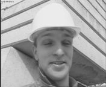
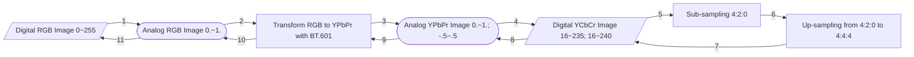
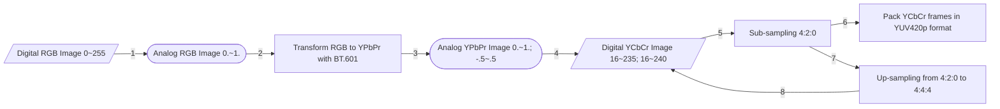

# Assignment 1 Code Outputs

## Task 1

Convert an image from RGB to YCbCr `4:2:0` and recover it.

*Assume that the copied image is equivalent to the original image.*

### Statistical Comparison

Compare between the copied and transformed images in the RGB color space.

There are the metric results computed
between the copied and transformed images below:

```python
[['<Metrics>', '<Score>', '<Goal>'],
 ['MAE', '0.48102', '0.00000'],
 ['MSE', '0.73883', '0.00000'],
 ['NRMSE', '0.00483', '0.00000'],
 ['PSNR', '49.44534', 'inf'],
 ['SSIM', '0.99853', '1.00000']]
```

### Visual Comparison

Display images.

There are the images in the RGB color space below; by the way,
I add transformed images from YCbCr to RGB using `utils/YUVDisplay.exe`:

| Copied Image | Transformed Image (Mine) | Transformed Image (YUVDisplay.exe) |
| ------------ | ------------------------ | ---------------------------------- |
|  |  |  |

There are the images in the YCbCr color space re-mapped in the grayscale colorspace:

|             | Before sub-sampling | After sub-sampling | After up-sampling |
| ----------- | ------------------- | ------------------ | ----------------- |
| On Y plane  |   |  |   |
| On Cb plane |  |   |  |
| On Cr plane |  |   |  |

### Details

The workflow is as follows:



## Task 2

Convert the multiple images from RGB to YCbCr `4:2:0` color space
and pack them into a planar format.

### Comparison between the images with and without sub-sampling

The sub-sampled images are re-mapped from YCbCr to grayscale color space
for visualization purposes.

The up-sampled images are for comparison purposes.

The original image `0` in the RGB color space:


The transformed image from `0` re-exported using `utils/YUVDisplay.exe`:


The transformed images on different Y, Cb and Cr planes
from `0` in the grayscale colorspace:

|             | Without sub-sampling | With sub-sampling | With up-sampling |
| ----------- | -------------------- | ----------------- | ---------------- |
| On Y plane  |   |  |   |
| On Cb plane |  |   |  |
| On Cr plane |  |   |  |

The original image `1` in the RGB color space:


The transformed image from `1` re-exported using `utils/YUVDisplay.exe`:


The transformed images on different Y, Cb and Cr planes
from `1` in the grayscale colorspace:

|             | Without sub-sampling | With sub-sampling | With up-sampling |
| ----------- | -------------------- | ----------------- | ---------------- |
| On Y plane  |   |  |   |
| On Cb plane |  |   |  |
| On Cr plane |  |   |  |

The original image `2` in the RGB color space:


The transformed image from `2` re-exported using `utils/YUVDisplay.exe`:


The transformed images on different Y, Cb and Cr planes
from `2` in the grayscale colorspace:

|             | Without sub-sampling | With sub-sampling | With up-sampling |
| ----------- | -------------------- | ----------------- | ---------------- |
| On Y plane  |   |  |   |
| On Cb plane |  |   |  |
| On Cr plane |  |   |  |


Take the images with sequence number `2` to further comparison.

Below are the comparison metrics,
they are computed between the image without sub-sampling
and the other one with sub-sampling and up-sampling in the YCbCr color space:

The image pair on Y plane:

```python
[['<Metrics>', '<Score>', '<Goal>'],
 ['MAE', '0.00000', '0.00000'],
 ['MSE', '0.00000', '0.00000'],
 ['NRMSE', '0.00000', '0.00000'],
 ['PSNR', 'inf', 'inf'],
 ['SSIM', '1.00000', '1.00000']]
```

The image pair on Cb plane:

```python
[['<Metrics>', '<Score>', '<Goal>'],
 ['MAE', '0.01417', '0.00000'],
 ['MSE', '0.04257', '0.00000'],
 ['NRMSE', '0.00173', '0.00000'],
 ['PSNR', '61.83934', 'inf'],
 ['SSIM', '0.99984', '1.00000']]
```

The image pair on Cr plane:

```python
[['<Metrics>', '<Score>', '<Goal>'],
 ['MAE', '0.02095', '0.00000'],
 ['MSE', '0.21784', '0.00000'],
 ['NRMSE', '0.00346', '0.00000'],
 ['PSNR', '54.74938', 'inf'],
 ['SSIM', '0.99982', '1.00000']]
```

### Details

The workflow is as follows:



## Task 3

Quantize and encode YCbCr `4:2:0` images and recover them.

Taking quantization levels as symbols, here are the Huffman tree and code table used:

```python
{0: '10000001',
 1: '10000000',
 2: '1000001',
 3: '100001',
 4: '10001',
 5: '1001',
 6: '1100',
 7: '01',
 8: '111',
 9: '0010',
 10: '00001',
 11: '00000',
 12: '0001',
 13: '101',
 14: '1101',
 15: '0011'}
```


### Comparison between the images without and with quantization

The quantized versions are visually different from the original RGB images.

The transformed image `0` on different Y, Cb and Cr planes in the grayscale colorspace:

|             | Before quantization | After quantization & de-quantization |
| ----------- | ------------------- | ------------------------------------ |
| On Y plane  |   |  |
| On Cb plane |    |   |
| On Cr plane |    |   |


